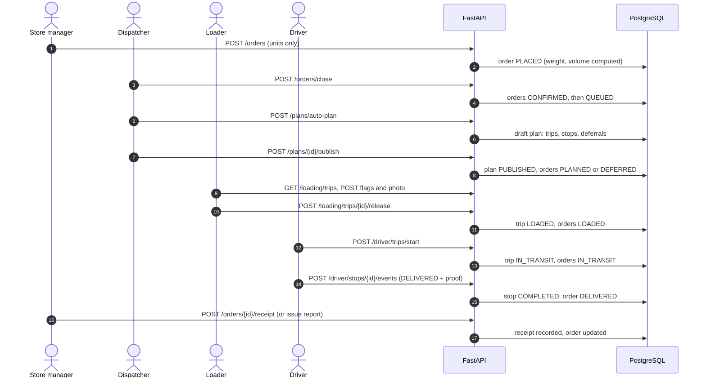

# Waypoint architecture

Waypoint is a three-part system started by one `docker compose up`: a PostgreSQL database, a FastAPI backend
and a React web app. This page shows the components, how an order moves through them, and the main design
decisions. The tables and their relationships are in [`data-model.md`](data-model.md).

## Components

```mermaid
flowchart LR
  subgraph Browser["Browser (React + TypeScript, installable PWA)"]
    direction TB
    Roles["Role modules<br/>dispatcher, store manager,<br/>loader, driver"]
    Shell["Shared shell, sign-in and<br/>role guards"]
    Contract["Apis contract<br/>(domain/api)"]
    Http["HTTP adapter<br/>JWT bearer token"]
    Local["Local demo adapter<br/>(only with no backend configured)"]
    Offline[("IndexedDB (Dexie)<br/>offline queue, saved proof,<br/>store outbox")]
    SW["Service worker<br/>cached screens"]
    Roles --> Shell --> Contract
    Contract --> Http
    Contract --> Local
    Roles --> Offline
    Browser --- SW
  end

  subgraph API["FastAPI backend"]
    direction TB
    Routers["Routers<br/>auth, reference, orders, plans,<br/>deferrals, loading, driver,<br/>analytics, admin, health"]
    Deps["Dependencies<br/>JWT check + role check per endpoint"]
    Services["Services<br/>state machine, audit log,<br/>order sizing, calendar, forecast"]
    Clock["Business clock"]
    Planner["Planner package (pure Python)<br/>allocate, validate, distance, trip time"]
    Models["SQLAlchemy models + Alembic migrations"]
    Routers --> Deps --> Services
    Services --> Planner
    Services --> Clock
    Services --> Models
  end

  DB[("PostgreSQL 16")]
  Files[("Uploads volume<br/>delivery and loading photos")]
  CSV[["data/ CSV datasets<br/>outlets, vehicles, calendar,<br/>road conditions, travel, training data"]]

  Http -- "REST /api/v1" --> Routers
  Models --> DB
  Routers --> Files
  CSV -- "seed on start" --> DB
```

| Service in `docker-compose.yml` | What it runs |
|---|---|
| `db` | PostgreSQL 16 with a volume for its data |
| `api` | Applies the Alembic migrations, seeds the database from `data/`, then serves the FastAPI app |
| `frontend` | The Vite dev server for the React app |

## How an order moves through the system



State changes are also written to an audit log with the actor and the before and after state.

## Main design decisions

- **One planner, no framework.** The `planner` package has no database or HTTP imports. It takes plain
  objects (orders, vehicles, outlets) and returns trips, stops and deferrals, so the rules can be tested on
  their own. Adapters convert database rows to planner objects and back.
- **Rules in one place.** Capacity (weight and volume), temperature (only refrigerated vehicles carry chilled
  goods), the two-trip limit, van-only outlets and delivery windows are checked when planning and again when
  a plan is validated or published. Publishing is refused if a hard rule is broken.
- **State machines for orders, trips and stops.** `services/state_machine.py` lists the legal moves, for
  example an order goes PLACED, CONFIRMED, QUEUED, PLANNED, LOADED, IN_TRANSIT, DELIVERED, and can be
  DEFERRED or CANCELLED. A move that is not listed is refused.
- **Role checks on the server.** Each endpoint names the roles allowed to call it. The front end also guards
  each workspace, but the API is the authority.
- **The server owns sizes and clocks.** Stores enter units; the server computes weight and volume from the
  per-unit figures in the training data. Times shown to people come from the business clock (a fixed demo
  day with the real time of day), so an order's placed, planned, departed and delivered times agree.
- **A screen contract, two implementations.** Screens read and write through the `Apis` contract in
  `frontend/src/domain/api`. The HTTP adapter calls the backend; a local adapter backed by IndexedDB exists
  for development without a backend and is not used when `VITE_API_URL` is set.
- **Offline first for the field roles.** Delivery proof (photo, signature, quantities) is saved in
  IndexedDB and synced when the connection returns; the store manager's changes made offline wait in an
  outbox and are sent in order. A service worker caches the screens so the route stays available.
- **Idempotent sync.** Each delivery event carries a client-generated operation id, so retrying after a
  dropped connection never records a delivery twice.
