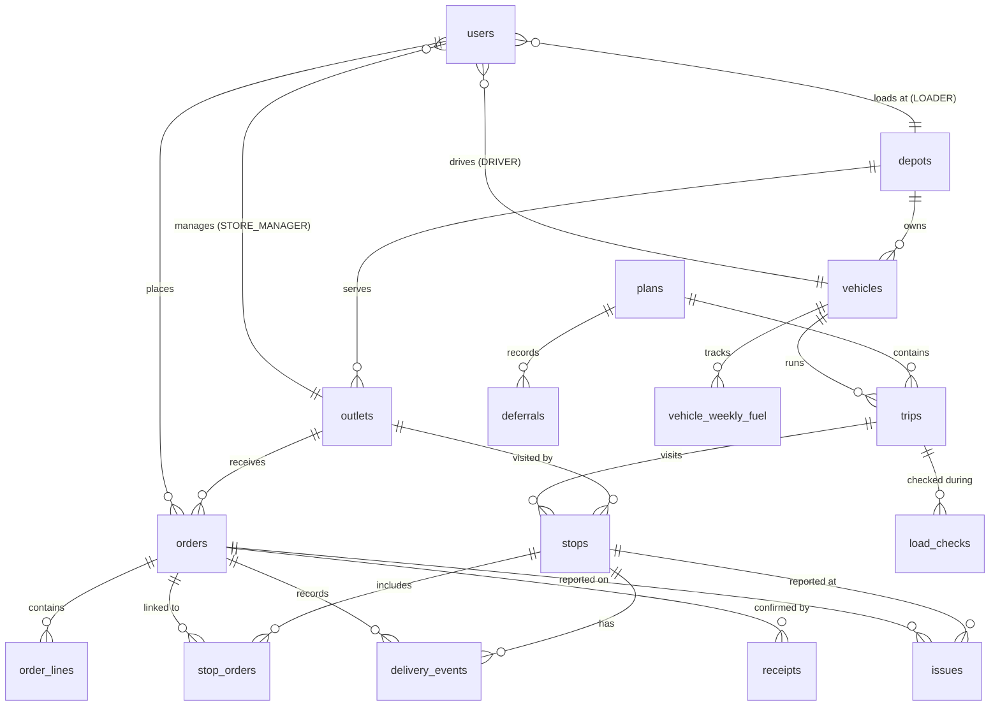

# Waypoint Data Model

> **Note**: Outlet and depot coordinates are **synthetic** (approximate district centroids + deterministic jitter from `outlet_id`). They are used only for haversine routing in the planner. Do not use for navigation.

## Tables and Relationships

### Reference Data

| Table | PK | Description |
|---|---|---|
| `depots` | `code` (string) | Peliyagoda / Kandy distribution centres |
| `outlets` | `outlet_id` (string) | 120 retail outlets; brand, district, window times, synthetic lat/lng |
| `vehicles` | `vehicle_id` (string) | 60 vehicles; 16 reefer trucks, 40 ambient trucks, 4 reefer vans, 4 ambient vans |
| `calendar_days` | `date` | 910 days (2024-01-01 → 2026-06-28); is_operating, payday, festival ramp |
| `vehicle_weekly_fuel` | `(vehicle_id, iso_year, iso_week)` | Running fuel consumption per vehicle per ISO week |

### Users & Auth

| Table | PK | Description |
|---|---|---|
| `users` | `id` (int) | 4 roles: DISPATCHER, LOADER, DRIVER, STORE_MANAGER; nullable FKs to outlet/vehicle/depot |

### Operational

| Table | PK | Description |
|---|---|---|
| `orders` | `id` (int) | Demand placed by store managers; 11 statuses |
| `order_lines` | `id` (int) | Per-SKU breakdown (optional; order totals denormalised) |
| `plans` | `id` (int) | Daily delivery plans; DRAFT → PUBLISHED → SUPERSEDED |
| `trips` | `id` (int) | Vehicle assignment within a plan; max 2 per vehicle; 6 statuses |
| `stops` | `id` (int) | Individual outlet visits within a trip; sequenced |
| `stop_orders` | `id` (int) | One-to-many join: orders on a stop |
| `deferrals` | `id` (int) | Orders skipped by the planner; tracks consecutive count |
| `load_checks` | `id` (int) | Loader flags per order: OK / MISSING / DAMAGED |
| `delivery_events` | `id` (int) | Driver POD events; `client_op_id` UNIQUE for offline idempotency |
| `receipts` | `id` (int) | Store manager confirmation: FULL / PARTIAL / DISPUTED |
| `issues` | `id` (int) | SHORT / DAMAGED / WRONG_ITEM / OTHER reports |
| `notifications` | `id` (int) | Per-user or role-broadcast notifications |
| `audit_log` | `id` (int) | Immutable event log; before/after JSON for every transition |

## ER Diagram



## Status State Machines

### Order
```
PLACED → CONFIRMED → QUEUED → PLANNED → LOADED → IN_TRANSIT → DELIVERED
                                      ↘ DEFERRED ↗                ↘ PARTIAL
                                      ↘ CANCELLED              FAILED → DEFERRED
```

### Trip
```
PLANNED → LOADING → LOADED → IN_TRANSIT → COMPLETED
        ↘ CANCELLED ↗↗↗↗↗
```

### Stop
```
PENDING → ARRIVED → COMPLETED
                 → PARTIAL
                 → FAILED → PENDING (retry)
```
